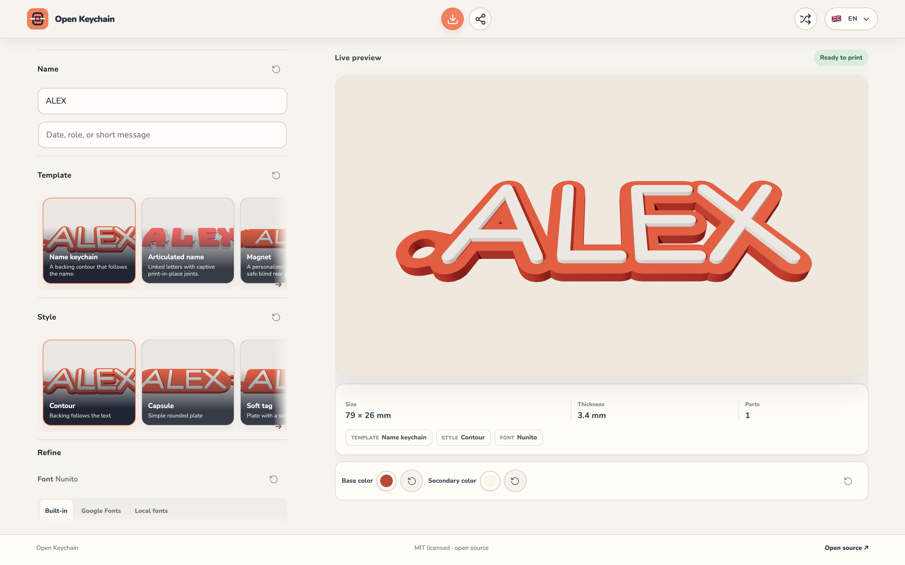
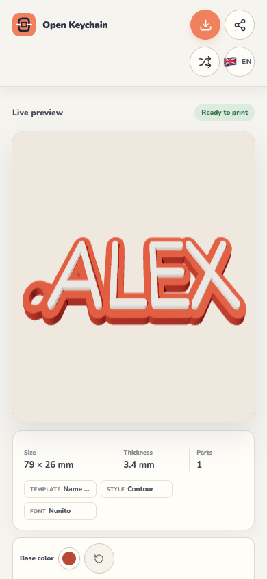

# Open Keychain

Open Keychain is an open-source, local-first tool for designing personalized 3D-printable keychains and labels. Enter a name, choose a template, preview the model, then export STL or 3MF for your own slicer and printer.

> Beta note: generated files still need checking in your slicer and testing on your printer. Filament, machine calibration, orientation, and slicer settings affect the physical result.



<p align="center">
  
</p>

## Use it locally

The browser version is free to use and does not require an account. Fonts, geometry generation, preview, and exports run in the browser in the default build.

```sh
pnpm install
pnpm dev
```

Open the local address printed by Vite, then visit `/create` to start designing.

### Optional Google Fonts

The included catalog works offline. To enable the opt-in Google Fonts browser, set
`VITE_GOOGLE_FONTS_API_KEY` before starting Vite or building the app. This browser-visible key
is public by design; restrict it in Google Cloud by HTTP referrer to your production domain and
local development origins. The app requests only Google family metadata and selected font files,
never the entered name or preview text. If the key is missing or requests are blocked, the
customizer keeps using the included fonts.

## Self-host it

### Docker

```sh
docker compose up -d --build
```

Open <http://localhost:8080>. The image builds the app and serves it with nginx; no database or environment variables are required for the default local workflow.

### Static hosting

```sh
pnpm install
pnpm build
```

Serve `dist/` from any static host. Configure an SPA fallback to `index.html` for `/` and `/create`, and allow normal static access to `/manifold.wasm`, `/fonts/`, `/showcase/`, and hashed `/assets/` files. [`nginx.conf`](nginx.conf) is a working reference.

For the optional hosted profile, use [`docs/hosting-readiness.md`](docs/hosting-readiness.md) for domain, HTTPS, secrets, backup, and private-pilot gates. Billing is not enabled.

## What you can make

- Name keychains with a keyring hole and raised lettering
- Articulated names with linked letters
- Nameplates for desks, drawers, or shelves
- Plant labels with a pointed stake

The customizer exports printable STL and 3MF files. Review the downloaded model in your slicer before printing; Open Keychain does not claim physical-print verification for every printer or material.

## Privacy and future hosting

The default local and self-hosted workflows keep generation and export on the device running the browser. This repository contains no active payment flow, price list, or hosted workspace offering. A future hosted workspace is only a concept for saved projects, seller presets, and repeat-order/batch tools.

## Development

```sh
pnpm validate
pnpm bench:matrix
pnpm test:e2e --workers=1
```

Install Chromium for the browser checks once with `pnpm exec playwright install chromium`. Use `pnpm capture:ui` when the reviewed customizer screenshots need to be refreshed; it is an explicit capture command and does not run in ordinary CI.

See [CONTRIBUTING.md](CONTRIBUTING.md) for development and pull-request guidance. Report vulnerabilities through the [security policy](.github/SECURITY.md).

## License and bundled fonts

Open Keychain is released under the [MIT License](LICENSE). Bundled fonts retain their own licenses; their notices are kept in [`public/fonts/licenses/`](public/fonts/licenses/).
